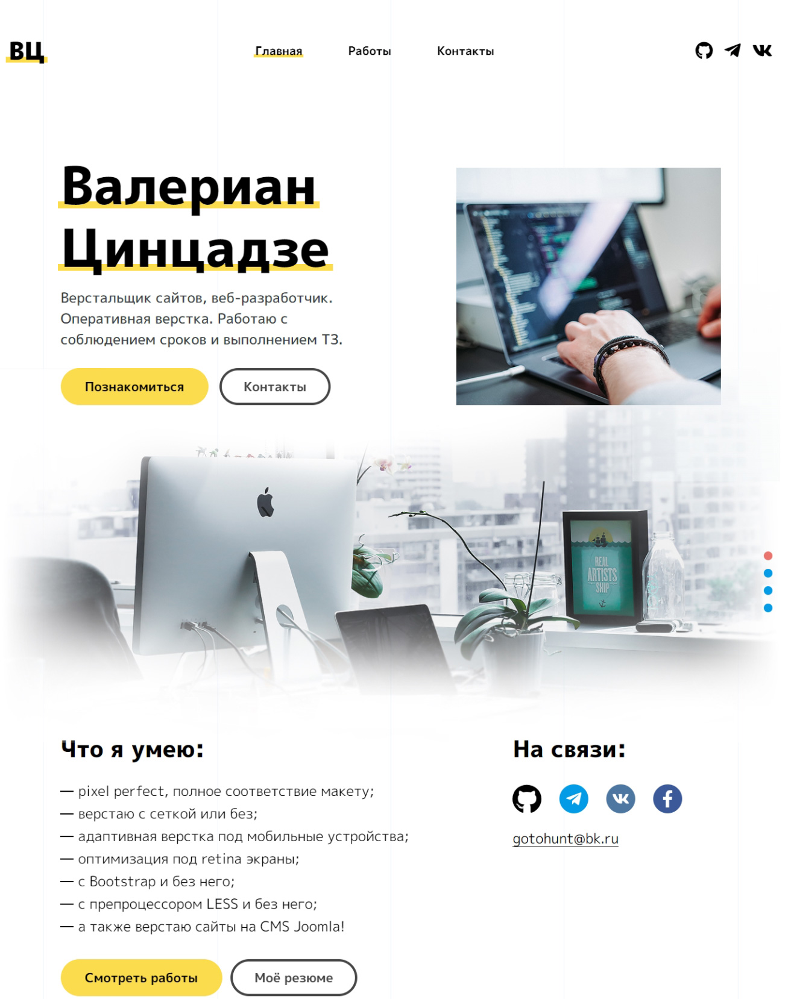

# Мой сайт-портфолио

## О проекте:

Мой сайт-портфолио по верстке и разработке сайтов. Данный проект я сверстал за время прохождения онлайн-курсов по верстке сайтов от [Webcademy.ru](https://webcademy.ru/).

* Срок выполнения: 14 дней
* Количество страниц: 14
* Демо онлайн: [valerian-web.ru](https://valerian-web.ru)
* Код на Github: [github.com/Anatoluch/portfolio-project](https://github.com/Anatoluch/portfolio-project)

## Технологии:

Адаптивная верстка, HTML5, CSS3, препроцессор Less, JavaScript, jQuery, PHP.

## Особенности:

Адаптивная верстка, мобильная навигация, выпадающее, меню, форма обратной связи, фильтр работ, ajax, валидация форм, кроссбраузерная верстка.
___
_Если Вам нужен специалист по верстке сайтов - обращайтесь! Я с удовольствием помогу!_
